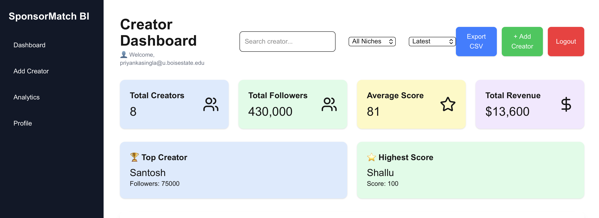
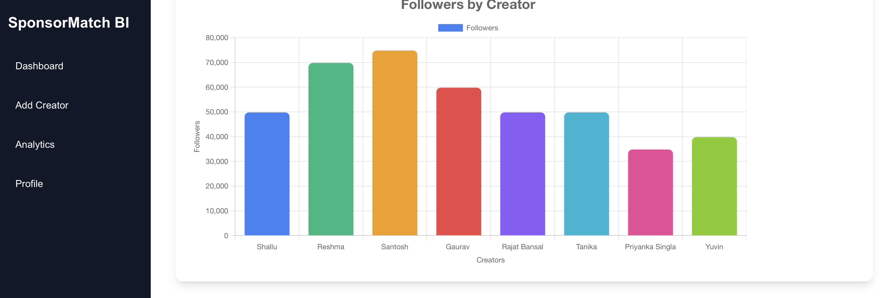
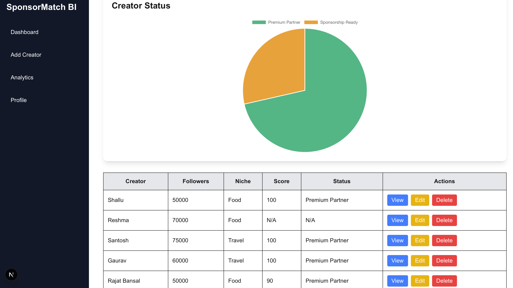
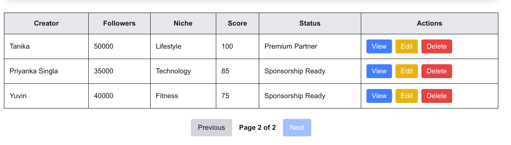
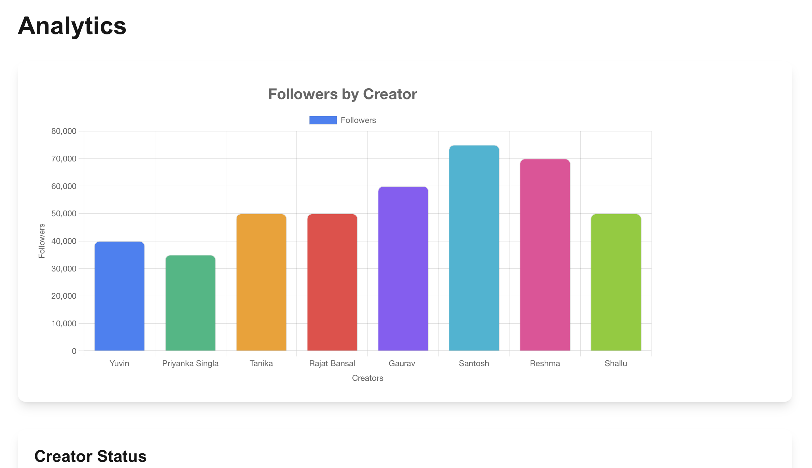
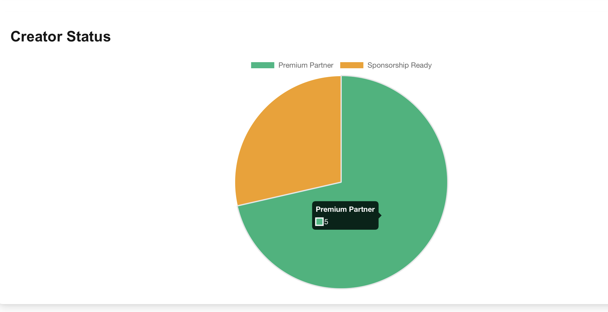
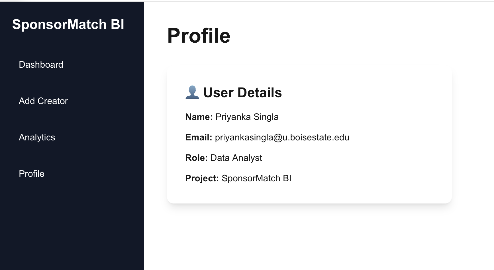
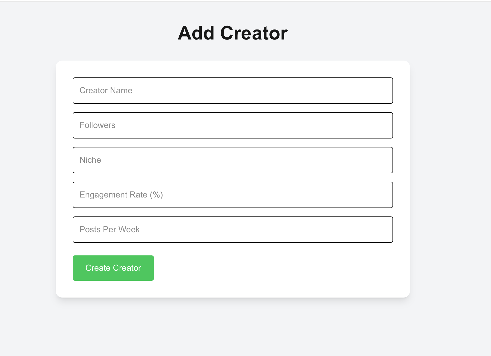

# SponsorMatch BI

A creator analytics dashboard that helps influencers analyze sponsorship readiness, engagement, revenue opportunities, and brand collaborations.

🔗 Live Demo: https://sponsor-match-bi.vercel.app

🔗 GitHub Repository: https://github.com/priyankasingla2912/SponsorMatch-BI

---

## Features

- User authentication (Login / Signup / Logout)
- Protected dashboard
- Creator management (Create, Read, Update, Delete)
- Search, filtering, sorting, and pagination
- KPI cards and analytics dashboard
- Revenue and sponsorship price estimation
- Brand recommendations based on creator niche
- Sponsorship insights and recommendations
- Social media profile integration:
  - Instagram
  - YouTube
  - TikTok
  - LinkedIn
- Interactive charts and analytics
- CSV export
- Sidebar navigation
- User profile page

---

## Technologies Used

- Next.js
- React
- Supabase
- Tailwind CSS
- Chart.js
- Vercel

---

## Screenshots

### Dashboard Part 1



### Dashboard Part 2



### Dashboard Part 3



### Dashboard Part 4



### Analytics Part 1



### Analytics Part 2



### Profile



### Add Creator



---

## Installation

Clone the repository:

```bash
git clone https://github.com/priyankasingla2912/SponsorMatch-BI.git
```

Move to the frontend folder:

```bash
cd frontend
```

Install dependencies:

```bash
npm install
```

Run the development server:

```bash
npm run dev
```

Open:

```text
http://localhost:3000
```

---

## Project Structure

```text
frontend
├── app
├── components
├── public
│   └── screenshots
├── lib
├── package.json
└── README.md
```

---

## Author

**Priyanka Singla**

Master of Science, Computer Science

Boise State University

---

## Note

This project was created for educational and portfolio purposes.